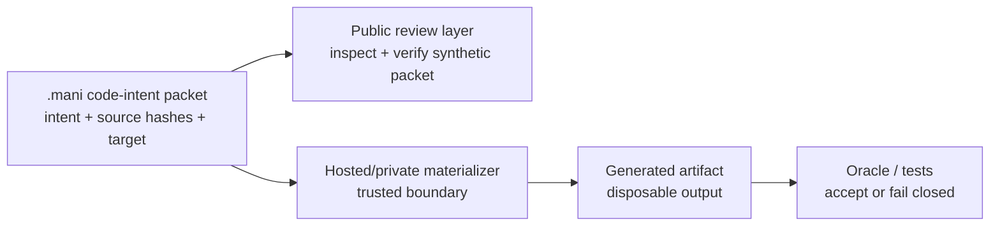

# Workflow Flow

> **In plain words:** This is the "what happens, in order" picture. A `.mani`
> code packet holds the *intent* of a code change — which code, what you want
> done, and which checks matter — not a pile of source files or a chat log. A
> trusted "materializer" expands that packet into real code, then an
> oracle/test either accepts it or refuses ("fails closed"). This public repo
> can only inspect and replay a built-in example; the private engine that does
> the real expansion is not included.

`.mani` packets store compact code-transformation intent, not prompt history or
an arbitrary source repository dump. A trusted materializer can expand the
packet at a controlled boundary.

Boundary notes:

- The `.mani` file is the portable intent artifact.
- Generated code is a disposable materialization, not the authoritative source
  of intent.
- Unsupported profiles should produce receipts, not guessed code.
- The public repo can inspect and replay a synthetic example; it does not
  contain the private materializer.
