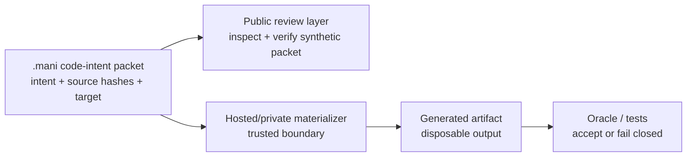

# Workflow Flow

`.mani` packets store compact code-transformation intent, not prompt history or
an arbitrary source repository dump. A trusted materializer can expand the
packet at a controlled boundary.

Boundary notes:

- The `.mani` file is the portable intent artifact.
- Generated code is a disposable materialization, not the authoritative source
  of intent.
- Unsupported profiles should produce receipts, not guessed code.
- The public repo can inspect and replay a synthetic example; it does not
  contain the private materializer.
